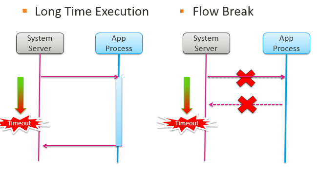
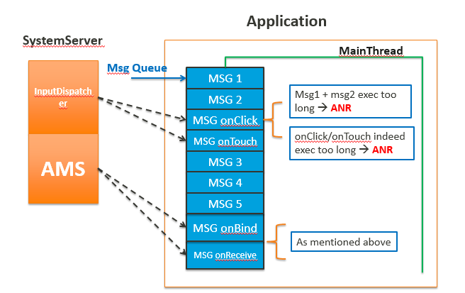

Application Not Responding
-----

### 1. 产生的原因
主线程任务执行时间过长(阻塞), 系统消息得不到响应;     
1. app自身进程主线程阻塞, 挂起, 死锁导致
2. 机器本身的cpu, 内存, io繁忙, 无法及时响应

根本原因还是在系统消息得不到响应造成的,盗用2张图来说明一下

#### 类型
Type | Method call | Log sample | time out
---- | ---- | ---- | -----
Input dispatch | onClick(),onTouch(),onKeydown(),onKeyup()…… | Input dispatching timed out | 8
Broadcast | onReceive() | Timeout of broadcast | FG: 10, BG 60
Service | onBind(),onCreate(),onStartCommand(),onUnbind(),onDestroy() | Timeout executing service | FG: 20, 
BG 200

### 2. trace分析

### ANR的trace文件获取
#### 1. 保存位置
- /data/anr/traces.txt  最近一次anr的信息
- /data/system/dropbox  发生的严重问题的信息

#### 2. DropBoxManager
DropBoxManager是系统用于记录运行过程中, 内核, 系统进程, 用户进程等出现严重问题时的log; 

可以通过监听`DropBoxManager.ACTION_DROPBOX_ENTRY_ADDED`广播, 在发生异常时, 获取数据;

##### 2.1 记录log的类型
- Crash      
    应用程序遇到异常,被强制关闭时的log
- ANR
- WTF     
   `Log.wtf()` 方法产生的数据
- strict_mode (StrictMode)      
    严苛模式产生的异常
