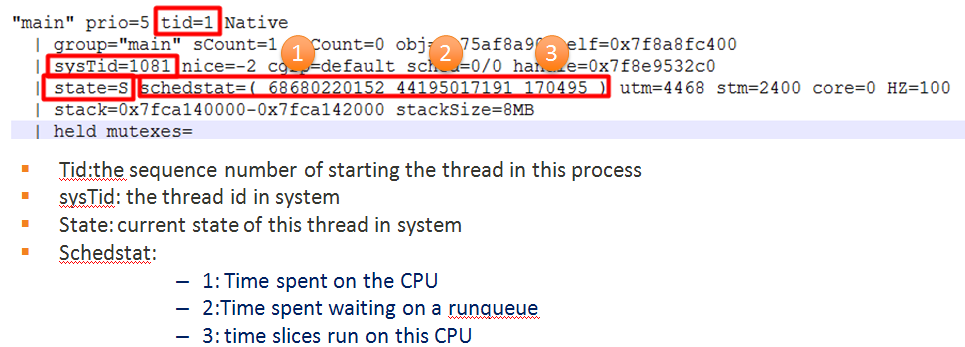

Application Not Responding
-----

### 1. 产生的原因
主线程任务执行时间过长(阻塞), 系统消息得不到响应;     
1. app自身进程主线程阻塞, 挂起, 死锁导致
2. 机器本身的cpu, 内存, io繁忙, 无法及时响应

根本原因还是在系统消息得不到响应造成的,盗用2张图来说明一下


#### 类型
Type | Method call | Log sample | time out
---- | ---- | ---- | -----
Input dispatch | onClick(),onTouch(),onKeydown(),onKeyup()…… | Input dispatching timed out | 8
Broadcast | onReceive() | Timeout of broadcast | FG: 10, BG 60
Service | onBind(),onCreate(),onStartCommand(),onUnbind(),onDestroy() | Timeout executing service | FG: 20, 
BG 200


### 2. trace分析
- 基本结构
```
// 线程名称,  线程优先级, 线程id, 线程状态
"main" prio=5 tid=1 Blocked
  | group="main" sCount=1 dsCount=0 obj=0x74960ee8 self=0xb83b52f0
    // 系统的线程id
  | sysTid=30752 nice=0 cgrp=default sched=0/0 handle=0xb6fcbbec
  | state=S schedstat=( 32407519095 10037462519 57602 ) utm=2867 stm=373 core=0 HZ=100
  | stack=0xbe26e000-0xbe270000 stackSize=8MB
  | held mutexes=
```
一般从主线程看起, 确定主线程的状态, 线程的状态可以看[线程的基础](./多线程 -- 线程相关基础.md)


#### 2.1 死锁
```
DALVIK THREADS (87):
"main" prio=5 tid=1 Blocked
  | group="main" sCount=1 dsCount=0 obj=0x74960ee8 self=0xb83b52f0
  | sysTid=30752 nice=0 cgrp=default sched=0/0 handle=0xb6fcbbec
  | state=S schedstat=( 32407519095 10037462519 57602 ) utm=2867 stm=373 core=0 HZ=100
  | stack=0xbe26e000-0xbe270000 stackSize=8MB
  | held mutexes=
  at com.eebbk.bfc.sdk.download.DownloadQueue.add(DownloadQueue.java:97)
  // 等待锁, lock的一个对象的,一般都是synchronized关键字的对象锁;  被id=87的线程持有
  - waiting to lock <0x0464a122> (a com.eebbk.bfc.sdk.download.DownloadQueue) held by thread 87
  at com.eebbk.bfc.sdk.download.DownloadManager.start(DownloadManager.java:195)
  at com.eebbk.bfc.sdk.download.services.DownloadServiceStub.start(DownloadServiceStub.java:76)
  at com.eebbk.bfc.sdk.download.BfcDownload.startTask(BfcDownload.java:219)
  at com.eebbk.bfc.sdk.downloadmanager.DownloadController.addTask(DownloadController.java:246)
  at com.eebbk.commonutils.download.DownLoadUtils.buildTask(DownLoadUtils.java:61)
  at com.eebbk.view.DownLoadStateView.openFile(DownLoadStateView.java:937)
  at com.eebbk.view.DownLoadStateView.access$1200(DownLoadStateView.java:60)

  ...

"pool-5-thread-4" prio=5 tid=87 Blocked
  | group="main" sCount=1 dsCount=0 obj=0x1364efa0 self=0xb8ad5f20
  | sysTid=11171 nice=10 cgrp=bg_non_interactive sched=0/0 handle=0xb8d97f20
  | state=S schedstat=( 8278520740 14167294365 95936 ) utm=423 stm=404 core=2 HZ=100
  | stack=0x9ca87000-0x9ca89000 stackSize=1036KB
  | held mutexes=
  at com.eebbk.bfc.sdk.download.DownloadManager.isDownloadManagerIdle(DownloadManager.java:723)
  // 等待一个锁, 该锁被tid=1的线程持有
  - waiting to lock <0x14a3e865> (a com.eebbk.bfc.sdk.download.DownloadManager) held by thread 1
  at com.eebbk.bfc.sdk.download.services.DownloadServiceStub.stopServiceDelayedIfIdle(DownloadServiceStub.java:223)
  at com.eebbk.bfc.sdk.download.services.DownloadServiceStub.onDownloadManagerIdle(DownloadServiceStub.java:177)
  at com.eebbk.bfc.sdk.download.DownloadManager.downloadQueueIdle(DownloadManager.java:713)
  at com.eebbk.bfc.sdk.download.DownloadQueue.scheduleNext(DownloadQueue.java:270)
  // 已经持有一个锁, 该锁被tid=1的线程等待
  - locked <0x0464a122> (a com.eebbk.bfc.sdk.download.DownloadQueue)
  at com.eebbk.bfc.sdk.download.DownloadQueue.taskFinished(DownloadQueue.java:200)
  at com.eebbk.bfc.sdk.download.DownloadManager.onRunnableFinished(DownloadManager.java:640)

```
死锁基本上是最好分析的ANR了,  main thread状态是block的,  等待一个锁, 可以找到持有该锁的线程id, 通过锁对象也可以搜索到;  然后找到持有该锁的线程状态, 对应解决;         
trace文件可以看出程序运行的流程, 不过由于dump内存顺序, 代码的调用顺序是从后向前的;     


### ANR的trace文件获取
#### 1. 保存位置
- /data/anr/traces.txt  最近一次anr的信息
- /data/system/dropbox  发生的严重问题的信息

#### 2. DropBoxManager
DropBoxManager是系统用于记录运行过程中, 内核, 系统进程, 用户进程等出现严重问题时的log; 

可以通过监听`DropBoxManager.ACTION_DROPBOX_ENTRY_ADDED`广播, 在发生异常时, 获取数据;

##### 2.1 记录log的类型
- Crash      
    应用程序遇到异常,被强制关闭时的log
- ANR
- WTF     
   `Log.wtf()` 方法产生的数据
- strict_mode (StrictMode)      
    严苛模式产生的异常
