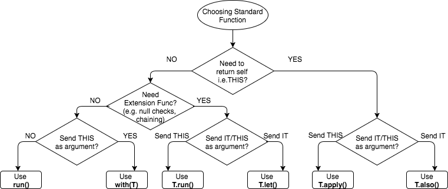

Kotlin标准库函数: run,let,also,apply,with 
----

一些 Kotlin 的标准函数非常相似，以至于我们都无法确定要使用哪一个。这里我会介绍一种简单的方式来区分他们的不同点以及如何选择使用

## 作用域函数
run, with(T), T.run, T.let, T.also, T.apply都支持闭包作为参数; 但是他们为调用者,在闭包内部提供了一个内部作用域, 我称他们为**作用域函数**(scoping functions);

最明显的是 `run` 函数

        fun test() {
            var mood = "I am sad"

            run {
                val mood = "I am happy"
                println(mood) // I am happy
            }
            println(mood)  // I am sad
        }

在`run`函数的区域内, `mood`变量被重新定义, 并不和外部的定义冲突, 并且定义之后的`run`函数的范围内, `mood`变量会覆盖外部定义; 

这么看上去,除了方法内拥有单独的作用域外, 并非特别有用; 但是这些方法还有一个特点, 它们拥有返回值; 
eg. 'run'的返回值是区域内的最后一个对象;

使用这个特性,可以使我们的代码更整洁: 
eg.我们想选择对某个view调用show()方法, 并不需要对每个view都进行调用,

        run {
            if (firstTimeView) introView else normalView
        }.show()

## 作用域函数的特点
### 1. 正常 vs. 扩展函数

我们看一下`with`和`T.run`函数, 会发现它们非常相似; 下面的代码,做了相同的事: 

        with(webview.settings) {
            javaScriptEnabled = true
            databaseEnabled = true
        }

        // similarly
        
        webview.settings.run {
            javaScriptEnabled = true
            databaseEnabled = true
        }

然而,`with`是一个正常的方法, 而`T.run`是一个扩展函数;

如果 webview.settings 可能为null, 那代码就会变成下面这样: 

        // Yack!
        with(webview.settings) {
                this?.javaScriptEnabled = true
                this?.databaseEnabled = true
            }
        }

        // Nice.
        webview.settings?.run {
            javaScriptEnabled = true
            databaseEnabled = true
        }

上面这个例子中, 明显`T.run`的扩展函数要好一些, 在使用变量之前,就做了非空检查; 而`with`内部需要每个都做检查;

### 2. this vs. it变量
上面说过, 这些函数内部, 新定义的变量都有单独的作用域, 不和外部冲突; 而这个作用域中, 最特殊的就是this 和 it;

如果我们看`T.run` 和 `T.let`, 会发现代码非常相似, 但是有一点不同, 内部使用的参数不同:

        stringVariable?.run {
            println("The length of this String is $length")
        }

        // Similarly.
        stringVariable?.let {
            println("The length of this String is ${it.length}")
        }

看一下`T.run`的函数定义, 会发现`T.run`是调用函数 `block: T.()`的扩展函数, 相当于给对象 `T` 添加了一个方法; 因此, 在它的作用域中, `T` 可以被引用为`this`; 而在实际变成中, `this`大部分情况下可以省略; 在上面代码中, `println`中的`$length`, 实际上就是`${this.length}`.  这种我称之为**this参数传递**;

而`T.let`的函数定义中, 你会发现`T.let`把它自己作为一个参数. 传递给了函数 `block: (T)`; 而在lambda表达式中, 一个参数可以省略, 使用`it`代替; 因此,在作用域中, `T`被引用为了`it`;  这种我称之为***it参数传递*;

从上面看, `T.run`好像比`T.let`更高级一点, 在`T.run`中可以隐式的使用`this`代替自身; 但是在部分情况下, `T.let`更合适一点;
- `T.let`更容易区分当前作用域的函数/变量和外部类的函数/变量
- 在`this`不能被省略的地方, `it`相比`this`更加清晰简短
- `T.let`中可以使用更好的变量命名 (`it`是lambda省略参数的指代, 因此可以把`it`转换为其他名字)

        stringVariable?.let {
            nonNullString ->
            println("The non null string is $nonNullString")
        }

### 2. 返回 this vs. 其他类型(block()函数的返回值)
看一下`T.let`和`T.also`, 如果只看函数作用域的代码, 会发现他们是一模一样的:

        stringVariable?.let {
            println("The length of this String is ${it.length}")
        }

        // Exactly the same as below
        stringVariable?.also {
            println("The length of this String is ${it.length}")
        }

但是, 他们的不同之处在于他们的返回值不同;  `T.let`的返回值,是对应调用的lambda表达式的返回值; 但是`T.also`返回了`T`自身, 也就是`this`;

示例如下:

        val original = "abc"

        // Evolve the value and send to the next chain
        original.let {
            println("The original String is $it") // "abc"
            it.reversed() // evolve it as parameter to send to next let
        }.let {
            println("The reverse String is $it") // "cba"
            it.length  // can be evolve to other type
        }.let {
            println("The length of the String is $it") // 3
        }

        // Wrong
        // Same value is sent in the chain (printed answer is wrong)
        original.also {
            println("The original String is $it") // "abc"
            it.reversed() // even if we evolve it, it is useless
        }.also {
            println("The reverse String is ${it}") // "abc"
            it.length  // even if we evolve it, it is useless
        }.also {
            println("The length of the String is ${it}") // "abc"
        }

        // Corrected for also (i.e. manipulate as original string
        // Same value is sent in the chain 
        original.also {
            println("The original String is $it") // "abc"
        }.also {
            println("The reverse String is ${it.reversed()}") // "cba"
        }.also {
            println("The length of the String is ${it.length}") // 3
        }

上面的`T.also`似乎没什么作用, 我们可以把几个also的代码合并到一个函数块中, 但是细想一下, 会有下面几个优势:
- 它可以为同一个对象, 提供更加清晰的处理流程, 提供更细力度的函数控制
- 它可以构建链式调用

如果两者结合使用, 使用`T.let`升级自身, `T.also`持有自身进行链式调用, 将会变得非常强大: 

        // Normal approach
        fun makeDir(path: String): File  {
            val result = File(path)
            result.mkdirs()
            return result
        }

        // Improved approach
        fun makeDir(path: String) = path.let{ File(it) }.also{ it.mkdirs() }

## 总结
通过上面3个特性, 我们可以更好的理解这几个函数的行为;       
比如上面没提到的`T.apply`函数, 它的性质如下:
- 它是一个扩展函数
- 它把`this`作为参数传递, 在函数体内, `this`指代调用者
- 它返回`this`, 即返回调用者自身

使用如下:

        // Normal approach
        fun createInstance(args: Bundle) : MyFragment {
            val fragment = MyFragment()
            fragment.arguments = args
            return fragment
        }

        // Improved approach
        fun createInstance(args: Bundle) = MyFragment().apply { arguments = args }

我们也可以用它把一个非链式调用的过程,变为链式调用:

        // Normal approach
        fun createIntent(intentData: String, intentAction: String): Intent {
            val intent = Intent()
            intent.action = intentAction
            intent.data=Uri.parse(intentData)
            return intent
        }

        // Improved approach, chaining
        fun createIntent(intentData: String, intentAction: String) =
                Intent().apply { action = intentAction }
                        .apply { data = Uri.parse(intentData) }

## 选择使用哪个函数?
根据函数的特点, 我们可以对函数进行分类, 构建一个决策树帮助我们选择使用哪个函数:

 

----------

## 参考:
1. [https://medium.com/@elye.project/mastering-kotlin-standard-functions-run-with-let-also-and-apply-9cd334b0ef84](https://medium.com/@elye.project/mastering-kotlin-standard-functions-run-with-let-also-and-apply-9cd334b0ef84)