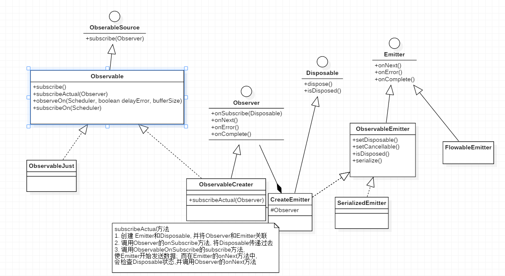

Observable  Observer
------
源码版本 2.1.7 https://github.com/ReactiveX/RxJava/tree/v2.1.7

        Observable.create((ObservableOnSubscribe<Integer>) e -> {
            e.onNext(1);
            e.onNext(2);
        }).subscribe(new Observer<Integer>() {
            @Override
            public void onSubscribe(Disposable d) {
                
            }

            @Override
            public void onNext(Integer integer) {

            }

            @Override
            public void onError(Throwable e) {

            }

            @Override
            public void onComplete() {

            }
        });

Observable作为生产者, 可以发送事件, 同时Observer作为观察者, 可以收到事件;   
源码分析的目的:
1. Observable 如何生产事件
2. Observable 怎么同 Observer 关联在一起 
3. Observer 如何接收事件 (即Observer的onNext方法如何被调用)

### 1. Observable.create 方法

#### 1.1 Observable.create

        public static <T> Observable<T> create(ObservableOnSubscribe<T> source) {
            ObjectHelper.requireNonNull(source, "source is null");
            return RxJavaPlugins.onAssembly(new ObservableCreate<T>(source));
        }

    `Observable.create` 是个静态方法, 逻辑比较简单    
    1. 对入参的检测
    2. 使用我们代码传入的 `ObservableOnSubscribe`对象, 构建 `ObservableCreate`
    3. 调用 RxJavaPlugins.onAssembly 方法并返回

#### 1.2 RxJavaPlugins.onAssembly   

先看 RxJavaPlugins.onAssembly 

        /**
        * Calls the associated hook function.
        * @param <T> the value type
        * @param source the hook's input value
        * @return the value returned by the hook
        */
        @SuppressWarnings({ "rawtypes", "unchecked" })
        @NonNull
        public static <T> Observable<T> onAssembly(@NonNull Observable<T> source) {
            // 用于hook, 默认 onObservableAssembly 为null
            Function<? super Observable, ? extends Observable> f = onObservableAssembly;
            if (f != null) {
                return apply(f, source);
            }
            return source;
        }

RxJavaPlugins.onAssembly 是一个用于hook的方法, 默认`onObservableAssembly`为null, 传入Observable和返回的Observable是同一个对象, 没有做任何处理;    

> 这个hook的接口, 在平时使用中, 没用到过, 具体用于做啥, 还要去看 

> 源码中有很多地方使用 `RxJavaPlugins` 进行了hook, 应该是设计用于使用者扩展; 但大部分都是和这个一样, 默认是传入什么, 就输出什么, 没做任何改变;

#### 1.3 ObservableCreate
上面说过,`RxJavaPlugins.onAssembly`是一个用于hook方法, 对输入没做任何处理, 在`Observable.create`的流程中, 核心也就只剩下创建 `ObservableCreate` 对象了;       

`ObservableCreate` 继承于 `Observable`, 内部拥有一个`ObservableOnSubscribe`(由构建时传入);

到此,`Observable.create`的流程结束       
简单说, `Observable.create`就只是创建了一个 `ObservableCreate` 对象, 该对象也是一个Observable, 并且持有我们传入的 `ObservableOnSubscribe`; 

### 2 Observable.subscribe

#### 2.1 Observable.subscribe(Observer)

    public final void subscribe(Observer<? super T> observer) {
        ObjectHelper.requireNonNull(observer, "observer is null");
        try {
            // hook 方法
            observer = RxJavaPlugins.onSubscribe(this, observer);
            // 入参检测
            ObjectHelper.requireNonNull(observer, "Plugin returned null Observer");
            // 实际执行的方法
            subscribeActual(observer);
        } catch (NullPointerException e) { // NOPMD
            throw e;
        } catch (Throwable e) {
            Exceptions.throwIfFatal(e);
            // can't call onError because no way to know if a Disposable has been set or not
            // can't call onSubscribe because the call might have set a Subscription already
            RxJavaPlugins.onError(e);

            NullPointerException npe = new NullPointerException("Actually not, but can't throw other exceptions due to RS");
            npe.initCause(e);
            throw npe;
        }
    }

1. hook扩展, 和上面创建Observable时的hook一样, 默认输入和输出一样, 没做任何处理
2. 入参检测
3. 执行事实际Observable对象`subscribeActual`方法, 上面的分析可以看出, 就是`ObservableCreate.subscribeActual`方法
4. 错误处理

> subscribe有很多重载方法, 但都会转换成Observer的调用; 其他的几个方法, 都会在内部被构建成`LambdaObserver`对象, 然后调用;

#### 2.2 Observable.subscribeActual
上面说过, Observable.create方法创建的Observable对象, 实际是`ObservableCreate`, 直接看`ObservableCreate.subscribeActual`方法;     

        @Override
        protected void subscribeActual(Observer<? super T> observer) {
            // 1. 创建Emitter对象, Observer和Emitter关联在一起
            CreateEmitter<T> parent = new CreateEmitter<T>(observer);
            // 2. 调用Observer的onSubscribe方法
            observer.onSubscribe(parent);

            try {
                // 3. 调用ObservableOnSubscribe的subscribe方法, 开始发送事件
                source.subscribe(parent);
            } catch (Throwable ex) {
                Exceptions.throwIfFatal(ex);
                parent.onError(ex);
            }
        }

1. 创建`CreateEmitter`对象, 同时会我们的`Observer`对象传入, 此时`Observer`和`Emitter`关联到一起了;并且`CreateEmitter`对象,也实现了`disposable`接口;
2. 调用`observer`的`onSubscribe`方法;
3. 调用`source.subscribe`; 
    - source是我们在使用Observable.create构建Observable时, 传入的`ObservableOnSubscribe`对象;  
    - 实际调用`ObservableOnSubscribe`的`subscribe`方法, 并将`CreateEmitter`作为参数传递了过去;
    - `ObservableOnSubscribe.subscribe`是由我们自己实现的, 里面调用`ObservableEmitter.onNext`发送事件; 即调用`CreateEmitter`的`onNext`方法

#### 2.2 CreateEmitter.onNext

上面说了,创建`CreateEmitter`对象时, 会将`Observer`传递过去; 发送事件,最终调用的也是`CreateEmitter`的`onNext`方法; 看上去Observable发送事件, Observer接收事件,即将关联到一起, 直接看`CreateEmitter.onNext`的代码;

        @Override
        public void onNext(T t) {
            // 1. null value的处理
            if (t == null) {
                onError(new NullPointerException("onNext called with null. Null values are generally not allowed in 2.x operators and sources."));
                return;
            }
            if (!isDisposed()) {
                // 2. 发送事件, 即直接调用 Observer的onNext
                observer.onNext(t);
            }
        }

1. null值处理, RxJava在2.x的版本中, 已经不允许发送null;
2. 发送事件, 即直接调用 Observer的onNext方法;

-----
到此基本分析已结束     
绕了一圈, 发现发送和接收事件, 其实就是将Observable和Observer组装到一起, 然后直接调用onNext方法, 是不是有点大失所望; 不过作为观察者模式的一种, RxJava的核心在于数据流转换,和线程切换, 后面再讲;

附上一张简单的类图
