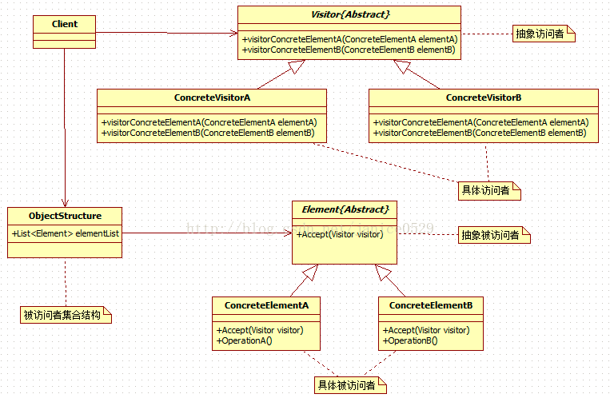

# Vistor Pattern
--------
### 1. 简介
**意图**: 将数据结构和数据操作分离
**主要解决**: 稳定的数据结构和易变的操作行为的耦合
- 结构:
1. 包含访问者和被访问元素两个主要组成部分; 
2. 被访问元素通常是不同的类型, 且不同的访问者,可以对他们进行不同的访问操作; (数据结构和对结构的操作解耦, 一个数据结果可以有多种操作)
3. 被访问元素通常不是单独存在的, 一般存储在一个集合中, 这个集合被称为'对象结构', 访问者通过遍历对象结构 实现对其中存储的元素进行逐个访问;

### UML

### 特点
1. 将数据结构, 和对数据结构的操作解耦, 是操作可以自由变化
2. 增加操作容易, 增加操作即增加新的访问者; 但是增加数据结构麻烦;
3. 访问者将有关操作行为集中到一个访问者对象中,很方便更换操作行为
### 适用范围
1. 对象结构很少改变, 但经常需要在此对象结构上定义新的操作; (XML解析, Java文件的class结构,ASM对java字节码的访问)
2. 需要对一个对象结构中的对象进行很多不同并且不行关的操作,而需要避免让这些操作"污染"这些对象的类，也不希望在增加新操作时修改这些类;  Visitor模式使得你可以将相关的操作集中起来 定义在一个类中
3. 该对象结构被很多应用共享, 用Vistor模式让每个应用仅包含需要用到的操作;

-------
###### 参考
1. http://www.runoob.com/design-pattern/visitor-pattern.html
2. http://blog.csdn.net/janice0529/article/details/41151987

