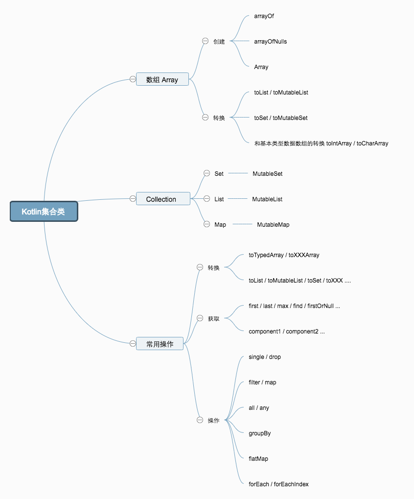

### kotlin集合类笔记
--------

##### Array
1. Kotlin中, Array属于基本类型的一种, 不属于Collection;  但是和Array和Collection有很多相似的地方, 并且可以相互转换, 两者有很多相同的方法(eg. filter, forEach), 平时代码操作类似
2. 对于基本数据类型, 有相应的xxxArray (eg. IntArray, CharArray), 用于减少基本类型的封包开包的性能消耗; 和Array<*>之间可以相互转换; 
    - 和Java对应的关系: Array<Int> -> Integer[], IntArray -> int[]

##### Collection
1. 分为可变集合,不可变集合
2. 一般使用工厂方法生成, eg, listOf, hashMapOf, mutableListOf; 但是有些集合类, 并没有提供相应的工厂方法, 还是要调用构造方法生成, eg, LinkedList
