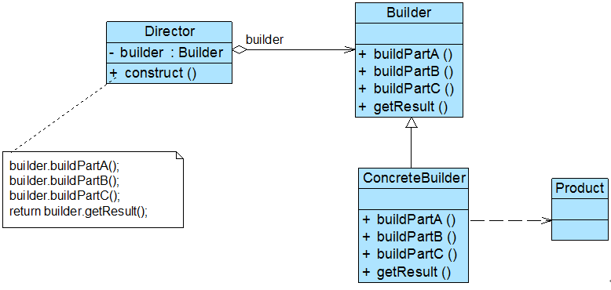

## OO的设计原则
1. 单一职责
2. 开闭原则   对扩展开放, 对修改关闭
3. 依赖倒转   抽象不应该依赖细节,细节依赖与抽象; 面向接口编程
4. 接口隔离   使用多个专门的接口,而不是使用单一的总接口
5. 合成复用   尽量使用对象组合,少用继承来达到复用的目的;  用HAS-A, 而不是IS-A
6. 迪米特法则  一个类应当尽可能少的和其他类相互作用

### 创建型
1. 简单工厂   

  | UML | 简化版本的UML |  
  |----|:----:|
  | |  |

  缺点:  
  - 由于工厂类集中了所有产品的创建逻辑，职责过重，一旦不能正常工作，整个系统都要受到影响。
  - 使用简单工厂模式势必会增加系统中类的个数（引入了新的工厂类），增加了系统的复杂度和理解难度。
  - 系统扩展困难，一旦添加新产品就不得不修改工厂逻辑，在产品类型较多时，有可能造成工厂逻辑过于复杂，不利于系统的扩展和维护

1. 工厂方法

  

  在简单工厂模式中，所有的产品都由同一个工厂创建，工厂类职责较重，业务逻辑较为复杂; 并且当有新产品要加入到系统中时，必须修改工厂类，需要在其中加入必要的业务逻辑，这违背了"开闭原则";   
  
  在工厂方法模式中，核心的工厂类不再负责所有产品的创建，而是将具体创建工作交给子类去做。这个核心类仅仅负责给出具体工厂必须实现的接口，而不负责哪一个产品类被实例化这种细节，这使得工厂方法模式可以允许系统在不修改工厂角色的情况下引进新产品
1. 抽象工厂
2. 单例Singleton     
    懒汉和饿汉
    线程安全: 静态内部类, Double Check;
3. Builder
    

    Director（指挥者）：指挥者又称为导演类，它负责安排复杂对象的建造次序，指挥者与抽象建造者之间存在关联关系，可以在其construct()建造方法中调用建造者对象的部件构造与装配方法，完成复杂对象的建造。客户端一般只需要与指挥者进行交互;    
    很多情况下,Director会被简化, 会和Builder类进行合并
4. 原型Prototype

### 结构型
