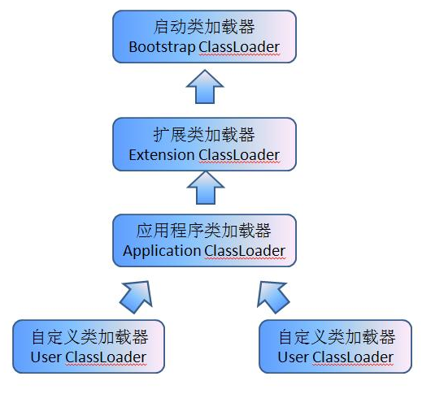

## java 类加载

### 类加载过程
#### 1.类从被加载到虚礼机使用,到内存回收, 经过的几个阶段
	加载(Loading) -> 验证(Verification) -> 准备(Preparation) -> 解析(Resolution) -> 初始化(Initialization) -> 使用(Using) -> 卸载(Unloading)    
	其中 Loading, Verification, Preparation, Initialization, Unloading是顺序执行的, Resolution则不一定;
	
##### 1.1 加载
在加载阶段, 虚礼机要完成3件事
1. 通过一个类的全限定名,来获取定义此类的二进制字节流
2. 将这个字节流所代表的静态存储结构,转换为方法区运行时的数据结构
3. 在内存中生成一个代表这个类的java.lang.Class对象, 作为方法区这个类的各种数据的访问入口

> 加载阶段是开发人员可控性最强的, 加载既可以使用系统的类加载器完成,也可以由我们自定义的类加载器去完成;  我们一般通过自定义类加载器,去控制字节流的获取方式(重写类加载器的loadClass()方法)

> 在整个类加载的过程中, 除了在加载阶段, 我们可以通过自定义的类加载器来参与之外, 其他的过程(Verification,Preparation, Resolution, Initialization)完全有虚拟机来主导控制; 

#### 2.类加载器
 对于任意一个类,都需要由类加载器和这个类本身一同确认其在Java虚拟机中的唯一性,每一个类加载器,都拥有一个独立的类名称空间; 即同一个类,必须由同一个类加载器加载,才是相等的; 如果由不同的类加载器加载的同一个类, 代表类的Class对象的 equals(), instanceOf 等方法返回的是false;
 
 ##### 2.2 双亲委派机制
 从Java虚拟机的角度来讲,只存在两种类加载器,一种是启动类加载器(Bootstrap ClassLoader),这个是虚拟机的一部分, 另一种是其他类加载器, 独立于虚拟机,都继承自抽象类java.lang.ClassLoader;
 
 从程序员的角度看,还可以分的更细一点
 - 启动类加载器(Bootstrap ClassLoader)
 - 扩展类加载器(Extension ClassLoader), 负责加载<JAVA_HOME>/lib/ext目录中的类库
 - 应用程序类加载器(Application ClassLoader), 这个类加载器是ClassLoader的 getSystemClassLoader() 方法的返回值, 一般也称他为系统类加载器. 它负责加载用户类路径(ClassPath)上所指定的类库;
 - 我们的应用一般由上面3个类加载器相互配合加载, 如果有需要, 我们也可以加入自己的类加载器;
 
 **双亲委派模型**: 除了顶层的启动类加载器外, 其余的类加载器都需要有自己的父类加载器;   
 **工作流程**: 如果一个类加载器收到类加载的请求, 首先不会自己尝试去加载这个类, 而是把这个请求委派给父加载器去完成, 只有当父加载器反馈无法完成这个加载请求时, 子加载器才会尝试自己去加载;
 
 
 
 > 双亲委派模型并不是强制性的约束规定,是Java设计者推荐给开发者的方式, 大部分类加载器都遵循这个规则, 但是也有例外;
 
 - 每个类加载器都有一个父加载器;
	 上面说,当类加载器无法加载时,会委托其父加载器去加载; 而父加载器由`getParent()`方法获取; 加载器与父加载器之间,一般不是采用继承实现,而是组合;
- **自定义类加载器**: 如果不想打破双亲委派模型, 只需重新findClass方法即可, 在里面调用difineClass定义一个class对象并返回;  如果想打破双亲委派模型,就得重新整个loadClass方法;
	 
 ------
 ## Android虚拟机中的类加载
 
 
 ------
 参考:
 深入理解JVM虚拟机, 第七章

